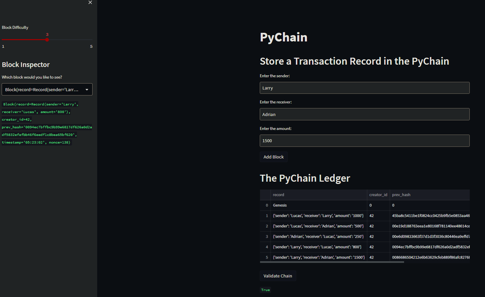
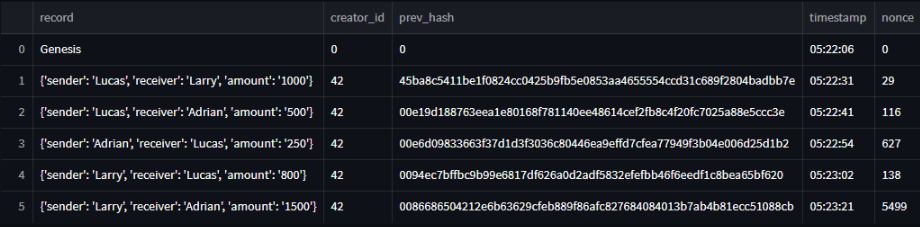

# Module 18 - PyChain Ledger
## Summary
This repository contains the code for a blockchain ledger application built using Python. I have used the PyChain ledger and Streamlit library to create a user interface. The application allows the user to enter transactions into the ledger by entering values for the sender, receiver, and amount, and then adding the block. The interface has a drop down menu to verify the block contents and hashes, and is able to test the blockchain validation.

Below is a screenshot of first, the Streamlit app with numerous transactions that I have added - I tested the validity of the blockchain which returned a value of 'True'. The second screenshot shows an expanded view of the ledger, displaying the hash values, timestamp and nonce values. 

